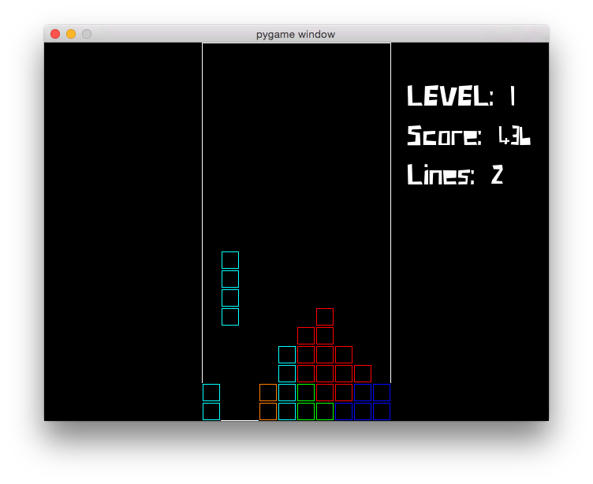

  

# Tetris clone with Pygame

Informational sources:
* [Tetriminos](http://strategywiki.org/wiki/Tetris_Party/Tetriminos)
* [Controls](http://www.tetrisfriends.com/help/tips_appendix.php#controls)
* [Terms](http://www.tetrisfriends.com/help/tips_appendix.php#tetristerminology)
* [Mechanics](http://meatfighter.com/nintendotetrisai/)
* [Mechanics 2](http://www.colinfahey.com/tetris/tetris.html)

Sound resources:
* [DrPetter's sfxr](http://www.drpetter.se/project_sfxr.html)

